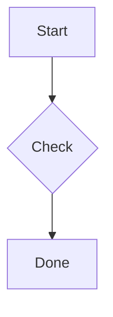

# Heading 1
## Heading 2
### Heading 3
#### Heading 4
##### Heading 5
###### Heading 6

Paragraph with **bold**, *italic*, ~~strike~~, `inline code`, <kbd>Ctrl</kbd>+<kbd>F</kbd>, :rocket: emoji, a [link](https://example.com), a [[Wiki Link]], an autolink <https://ghostex.dev>, and a raw URL https://example.com/path.

- Bullet one
- Bullet two
  - Nested bullet
1. First
1. Second
- [ ] Open task
- [x] Done task
- [~] In progress
- [-] Dropped

> A blockquote line.

> [!NOTE]
> A GitHub note alert.

> [!WARNING]
> A warning alert.

```rust
fn main() {
    println!("hi");
}
```

Inline math $e^{i\pi} + 1 = 0$ and display math:

$$
\int_0^1 x^2 \, dx = \frac{1}{3}
$$



| Name | Value |
| --- | ---: |
| alpha | 1 |
| beta | 2 |

A footnote reference[^1].

[^1]: The footnote text.

---


<details>
<summary>More</summary>
Hidden text
</details>

<<<<<<< HEAD
ours
=======
theirs
>>>>>>> feature

Another note[^two] and the first again[^1].

[^two]: The second footnote.

[](pic.png)

:::mermaid
graph LR
  X --> Y
:::
